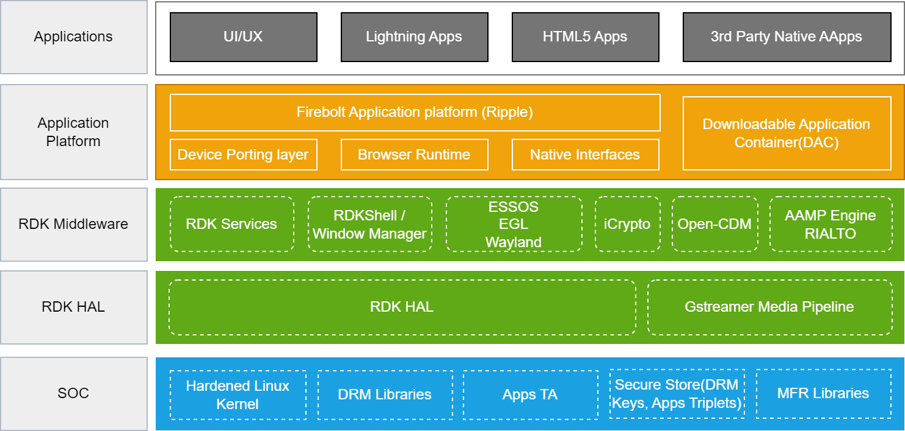

# Architecture Details

RDK consists of five main stack levels, each serving a specific purpose in the overall architecture.

Below is an illustrative representation of the RDK Video software stack, depicting the various components and their interactions.

At its core, RDK consists of five main stack levels, each serving a specific purpose in the overall architecture. These levels are as follows:

## RDK HAL

The RDK Hardware Abstraction Layer (HAL) is a crucial component that interfaces with hardware-specific functionalities in the RDK environment. RDK HAL leverages the libcamera pipeline for efficient camera integration, enabling streamlined communication between the hardware and higher-level software components. Additionally, it utilizes libv4l2, providing a standardized interface for video capture devices. The combination of RDK HAL, the libcamera pipeline, and libv4l2 ensures seamless integration and optimal utilization of hardware resources, enhancing the overall performance and functionality of RDK-based systems

## SOC

The System-on-Chip (SoC) functionalities encompass a range of capabilities crucial for system operation. The Linux kernel serves as the core operating system, providing a stable foundation for software applications. SoC functionalities include camera and video drivers that facilitate communication between the hardware and software layers, enabling the utilization of imaging devices.

Moreover, Image Signal Processing (ISP) plays a pivotal role in enhancing and refining image quality. Integrated into the SoC, ISP manages tasks such as color correction, noise reduction, and other image processing operations to optimize the output from imaging sensors.

In summary, the SoC functionalities involve the orchestration of the Linux kernel, camera and video drivers, and ISP, collectively ensuring efficient communication with hardware components and enabling advanced image processing capabilities.

------------------------------------------------------------------------
